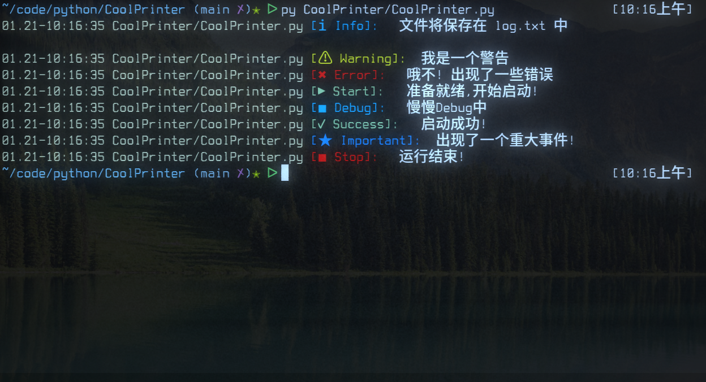

<div align="center">
	<h1 align="center">CoolPrinter</h1>
	<p align="center">一个简单而漂亮的print函数.</p>
	<br>
	
</div>

<hr>

# 安装

可以使用pip来安装CoolPrinter

```shell
[sudo] pip install signalepy
```

# 基础用法

初始化我们的类,就像这样

```python
from CoolPrinter import CoolPrinter

printer = CoolPrinter()
```

现在你可以进行漂亮的打印了,用法跟Python内置的print函数一模一样.

```python

...

printer.warning("我是一个警告")
printer.error("哦不! 出现了一些错误")
printer.start("准备就绪,开始启动!")
printer.debug("慢慢Debug中")

...

```
